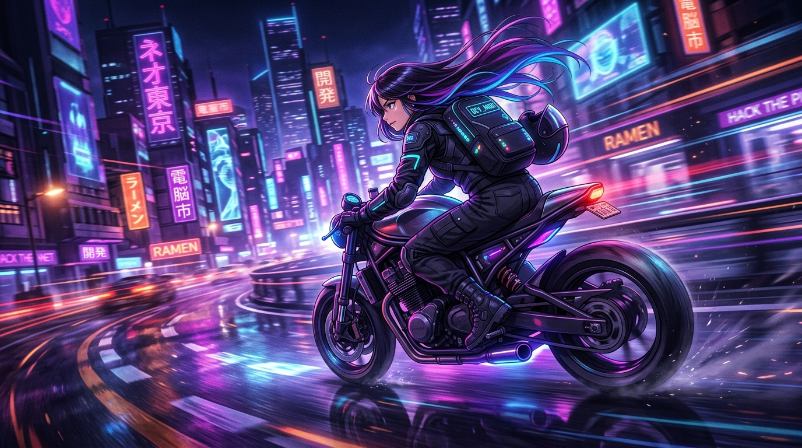
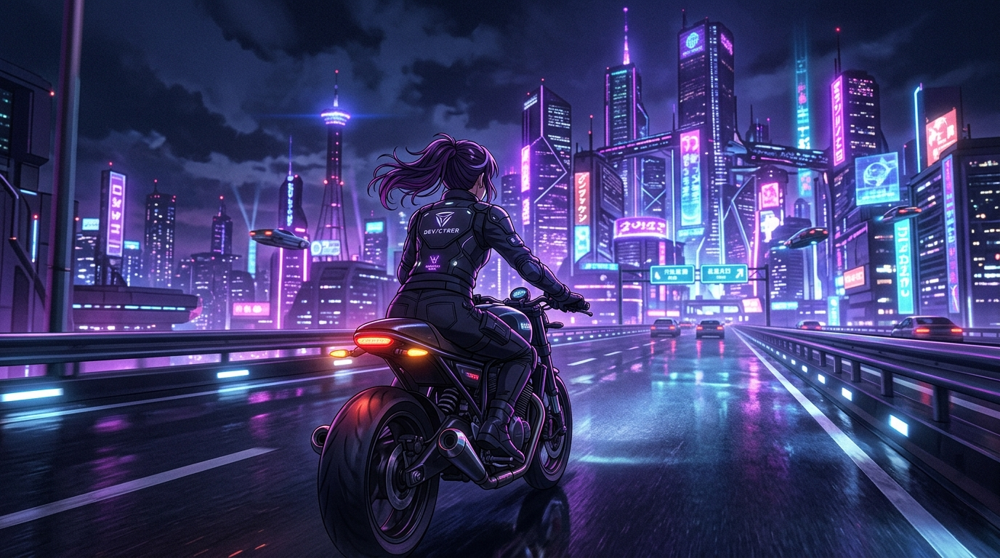

  

    

  # ✨ Hi, I'm Sujitha
  
  

   

  <i>"Building intelligent systems while chasing new roads."</i> 
  <code>Code. Create. Ride. Repeat. 🏍️</code>

 

 

## 👤 ABOUT ME

<table>
  <tr>
    <td width="50%" valign="top">
      <b>🎓 Education:</b>  
      B.Tech Information Technology  
      <i>Sri Shakthi Institute of Engineering and Technology</i>
    </td>
    <td width="50%" valign="top">
      <b>🌟 Interests:</b>  
      Artificial Intelligence • Agentic AI • Cloud Computing  
      Full-Stack Development • DevOps • Data Analytics • Automation
    </td>
  </tr>
</table>

 

 

## 🏍️ MY DIGITAL GARAGE

*Welcome to the garage. Each project is a mission.*

<table align="center" width="100%">
  <tr>
    <td align="center" width="50%" style="background-color: rgba(176, 38, 255, 0.05); padding: 20px; border-radius: 10px;">
      <h3>🚀 OPTRA  <i>(Main Quest)</i></h3>
      
<i>Agentic AI platform for discovering jobs, internships, hackathons, research opportunities, and government exams.</i>

      <code>Agentic AI</code> <code>Next.js</code> <code>Python</code>
        
      
    </td>
    <td align="center" width="50%" style="padding: 20px;">
      <h3>🧤 Smart Sensor Glove</h3>
      
<i>A smart wearable project combining hardware and software for intelligent interaction.</i>

      <code>IoT</code> <code>Sensors</code> <code>Python</code>
        
      
    </td>
  </tr>
  <tr>
    <td align="center" style="padding: 20px;">
      <h3>⚡ EV / Battery Intelligence</h3>
      
<i>Data analytics and intelligent systems for electric vehicles.</i>

      <code>Data Analytics</code> <code>Python</code>
        
      
    </td>
    <td align="center" style="padding: 20px;">
      <h3>🤖 Future AI Projects</h3>
      
<i>Exploring the boundaries of Agentic AI and cloud computing.</i>

      <code>Cloud</code> <code>AI</code>
        
      
    </td>
  </tr>
</table>

 

 

## ⚙️ SYSTEM LOADOUT

  

 

 

## 🛣️ CURRENT ROAD

  

 

 

## 📊 ENGINE STATUS

  
  

 

  

  

  

    
  
  <i>🌙 Keep building. Keep exploring. Keep moving.</i>
  
    

  
  
  

